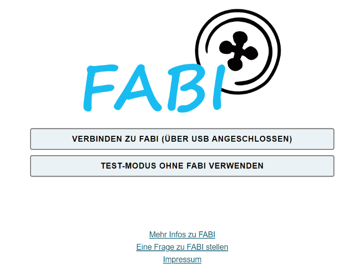
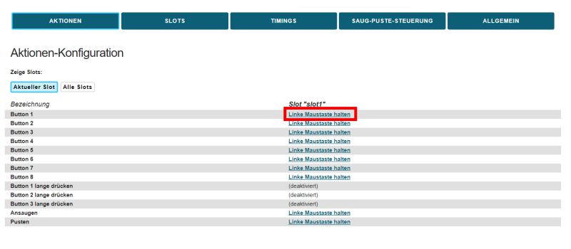
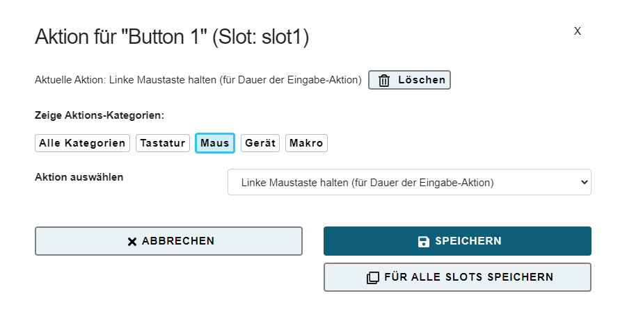
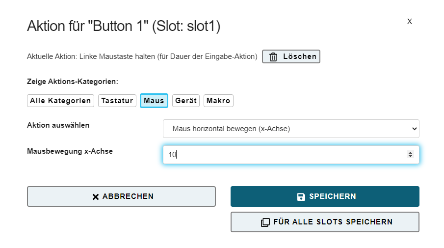
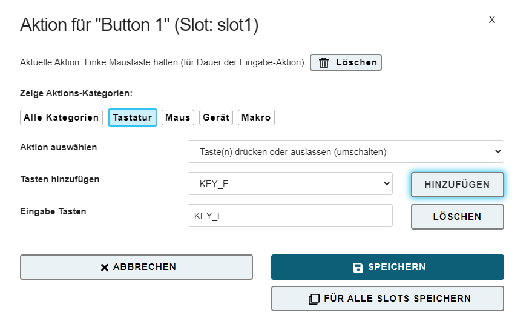
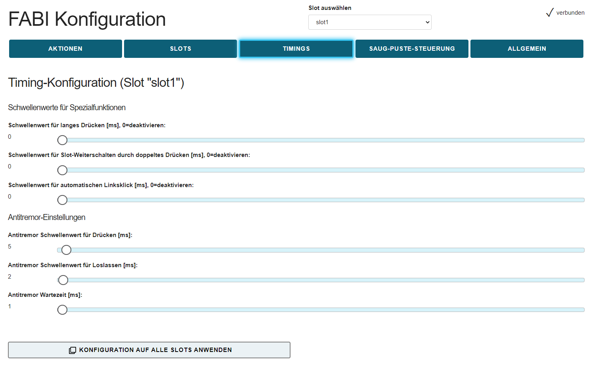
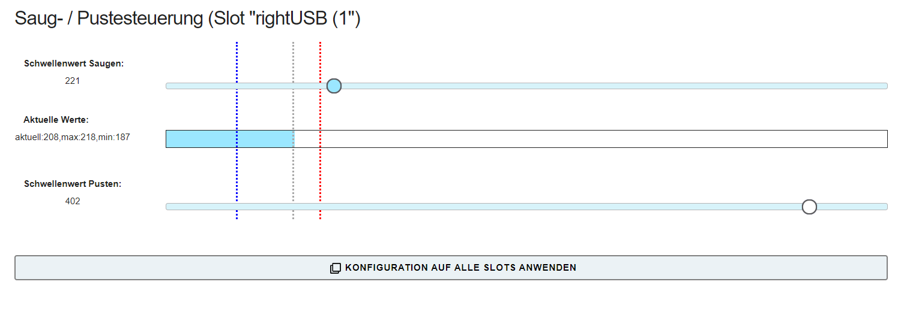
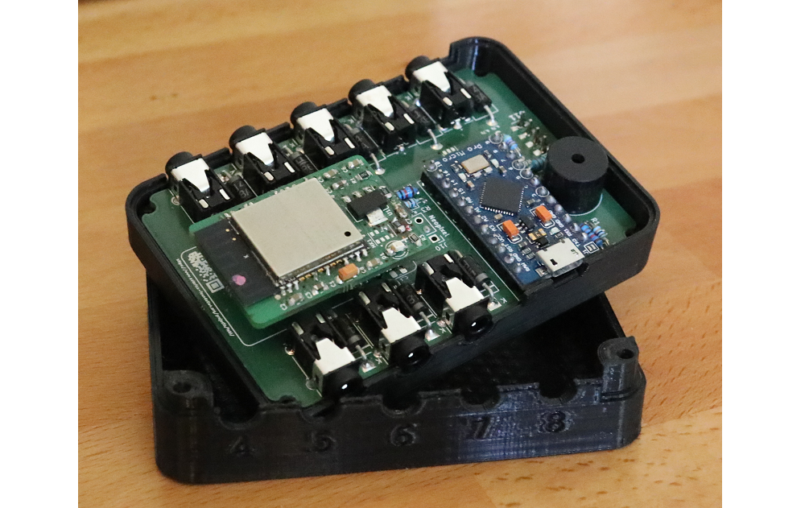

# FABI - Anwendungsanleitung

____

# Willkommen bei FABI

FABI - das „Flexible Assistive Button Interface“ - ermöglicht es, bis zu acht Taster (Buttons) an einen Computer oder ein Tablet/Smartphone anzuschließen und dadurch Maus- oder Keyboard-Aktionen auszulösen sowie andere Aktionen auszuführen. Ein konfiguriertes FABI-Modul kann mit jedem Computer (Windows, Linux oder Mac), ohne Installation von spezieller Software verwendet werden, weil sich das FABI-Modul beim Anschließen an den Computer wie eine gewöhnliche Computermaus bzw. eine Tastatur verhält. Menschen, für die herkömmliche Eingabegeräte nicht geeignet sind, können dadurch Computerspiele spielen, im Internet surfen, E-Mails schreiben und vieles mehr.

 

[TOC]

## Einleitung

Das FABI-System kann mit kommerziell erhältlichen Schaltern, günstigen Arcade-Buttons oder auch mit selbstgebauten elektrischen Kontakten verwendet werden. FABI besteht aus einem Hardware-Modul (einem kostengünstigen Mikrocontroller, der als Computermaus oder Tastatur fungiert), weiteren optionalen Modulen und Sensoren (Bluetooth-Add-On, Sip/Puff-Drucksensor) und einer grafischen Konfigurationsoberfläche zum Einstellen von gewünschten Funktionen („FABI-Konfigurationsmanager“). 

FABI ist als Open Source Bausatz (inkl. entsprechender Bauanleitung für die Hardware) verfügbar und wurde im Rahmen des AsTeRICS Academy Projektes der FH Technikum Wien entwickelt. 2017 wurde die gemeinnützige Organisation AsTeRICS Foundation gegründet, um derartige Technologien und Systeme weiterzuentwickeln und kostengünstig zur Verfügung stellen zu können: [www.asterics-foundation.org](https://asterics-foundation.org/).

Alle Softwaremodule, die Hardware-Designdateien und die Dokumente für die Anleitungen sind unter freien Open Source Lizenzen verfügbar und können kostenlos verwendet und verändert werden. Wir haben uns bemüht, preisgünstigste Komponenten auszuwählen und dennoch keine Kompromisse bei Funktionalität und Flexibilität zu machen – was FABI zu einer erschwinglichen Tasterschnittstelle mit umfangreichen Möglichkeiten macht!

Der **FABI-Konfigurationsmanager** wird benötigt, um die Funktionen der Taster / Buttons festlegen zu können. Nachdem eine Konfiguration im FABI-System gespeichert wurde, bleibt sie dort erhalten und das FABI-System kann zur Steuerung unterschiedlicher Geräte verwendet werden (z.B. Windows-PC, Mac-Computer, Tablet oder Smart-Phone mit USB- oder Bluetooth-Anschluss). Der Konfigurationsmanager wird erst wieder benötigt, wenn Einstellungen geändert werden sollen.

Der Konfigurationsmanager wird im Chrome Web-Browser geöffnet und ist unter folgender Adresse zu finden: [fabi.asterics.eu](https://fabi.asterics.eu/index_fabi.htm). Untenstehend in Abbildung 1 sehen sie die Startseite. Wenn Sie auf den Button VERBINDEN ZU FABI (ÜBER USB ANGESCHLOSSEN) klicken, so wird in der Auswahlbox noch kein Kommunikationsanschluss (COM Port) auswählbar sein, sofern Sie das FABI Modul noch nicht mittels USB-Stecker mit dem Computer verbunden haben. 

*Abbildung 1*: Startseite des Konfigurationsmanagers

#### Anschließen des USB-Micro Kabels

*Abbildung 2*: Anschließen des USB-Micro Kabels

#### Das FABI-Gerät verbinden

Um die Funktionen der Web-Konfiguration zu verwenden, folgen Sie den nachfolgenden Schritten:

1. Vergewissern Sie sich, dass das FABI- Gerät mit dem Computer verbunden ist. 
2. Danach sollte in einem Pop-Up Fenster ein Kommunikations-Anschluss (COM Port) mit bestimmter Nummer (z.B. COM4) auswählbar sein. Klicken Sie diesen Eintrag an und drücken Sie danach auf *Verbinden*. (Nach dem Ausstecken des FABI-Moduls sollte der COM Port wieder verschwinden.) 
3. **Sollten Sie nicht die Benutzeroberfläche des FABI Konfigurationsmanagers wie in Abbildung 3 sehen können, so öffnen Sie die Website erneut und wählen Sie einen anderen COM-Port in der aufpoppenden Auswahlbox. Danach klicken Sie erneut auf *Verbinden*.** 

## Verwendung des Konfigurationsmanagers

Nachdem Sie mit dem Kommunikations-Anschluss des FABI Systems verbunden sind, sehen Sie nun die Benutzeroberfläche des FABI Konfigurationsmanagers (Abbildung 3).

 

*Abbildung 3*: FABI-Konfigurationsmanager Benutzeroberfläche

#### Port Status

Der Portstatus rechts oben zeigt an, ob das FABI-Gerät aktuell mit dem Konfigurationsmanager verbunden ist. Die eingestellten Funktionen der Taster können nur dann ins Gerät übertragen werden, wenn als Port Status „Verbunden” angezeigt wird. Ist das Gerät nicht mehr verbunden, gelangen Sie wieder auf die Startseite.

#### Einstellungen speichern

Die getroffenen Einstellungen werden automatisch gespeichert und sind sofort im FABI-Gerät aktiv. **Die Konfigurationen bleiben auch dann erhalten, wenn das FABI System vom USB-Kabel bzw. von der Stromversorgung getrennt wird.** 

### Zuweisung der Taster-Funktionen (Reiter "AKTIONEN")

Im Reiter **AKTIONEN** können bis zu 8 Taster mit verschiedenen Funktionen belegt werden. Die Funktionen beinhalten etwa verschiedene Mausklicks, Mausbewegungen, Betätigung des Maus-Scrollrads oder von Keyboard-Tasten. Sie können die Aktion für den jeweiligen Taster ändern, indem Sie rechts vom gewünschten Button auf die unterstrichene (momentan aktive) Aktion klicken - siehe rotes Viereck in Abbildung 4.1. Dann erscheint ein Fenster, wo die gewünschte Aktions-Kategorie (hier: Maus) und die gewünschte Aktion ausgewählt werden kann (hier: Linke Maustaste halten). *Anmerkung:* Sollten mehr als 8 Taster benötigt werden, können mehrere FABI-Module parallel betrieben werden.

 

*Abbildung 4.1*: Aktion für Taster auswählen/ändern

 

*Abbildung 4.2*: Aktion für Taster auswählen (hier: Button 1)

#### Aktionskategorie Maus

##### Linke/Rechte/Mittlere Maustaste halten (für Dauer der Eingabe-Aktion)

Durch diese Funktionen bleibt die linke, rechte oder mittlere Maustaste gedrückt, solange der Taster gehalten wird (zum Beispiel, um eine Datei zu verschieben, ist es nötig, die linke Maustaste gedrückt zu halten). 

##### Klick linke/rechte/mittlere Maustaste

Mit diesen Funktionen kann einen Klick der linken, rechten oder mittleren Maustaste durch die Betätigung des Tasters ausgeführt werden. **Anmerkung**: ein Klick besteht aus drücken & loslassen der entsprechenden Maustaste, beides passiert kurz hintereinander nach der Betätigung des Buttons!

##### Doppelklick linke Maustaste

Ein Doppelklick der linken Maustaste ist zum Beispiel zum Öffnen einer Datei notwendig. Das Ausführen von schnellen Mausklicks kann jedoch für manche NutzerInnen schwierig sein. Durch das Zuweisen dieser Funktion kann ein Doppelklick durch einen einfachen Druck auf den Taster durchgeführt werden. 

##### Drücken oder Loslassen linke/rechte/mittlere Maustaste (wechseln)

Mit diesen Funktionen wird der Zustand der linken, rechten oder mittleren Maustaste geändert, wenn der Taster gedrückt wird. Beachten Sie, dass die Maustaste solange gedrückt bleibt, bis der Taster ein weiteres Mal gedrückt wird!

##### Nach unten / nach oben scrollen

Die Funktionen „Nach oben scrollen” und „nach unten scrollen” erzeugen durch den Taster Aktivitäten mit dem ein Scrollrad der Computermaus. Das Auslösen der “Nach oben scrollen” Funktion führt dazu, dass aufwärts gescrollt wird, bei der „Nach unten scrollen“ Funktion wird abwärts gescrollt (nützlich etwa zum Lesen von Dokumenten oder Webseiten).

##### Maus horizontal / vertikal bewegen – Mausbewegung in x- oder y-Richtung

Die „Maus horizontal bewegen (x-Achse)” und „Maus vertikal bewegen (y-Achse)” Funktionen erzeugen Computermausbewegungen entlang der gewählten Achsen. Für diese Funktionen können im darunter erscheinenden Feld Geschwindigkeitsparameter festgelegt werden. Beim Drücken des Tasters wird der Mauszeiger bis zu dieser maximalen Geschwindigkeit (zb. 20 oder -20) beschleunigt.

*Ein positiver Wert für die X-Richtung bewegt den Mauszeiger nach rechts.
Ein negativer Wert für die X-Richtung bewegt den Mauszeiger nach links.
Ein positiver Wert für die Y-Richtung bewegt den Mauszeiger nach unten.
Ein negativer Wert für die Y-Richtung bewegt den Mauszeiger nach oben.*

 

*Abbildung 5*: Screenshot der "Maus horizontal bewegen (x-Achse)"-Funktion bzw. Geschwindigkeitseinstellung

#### Aktionskategorie Tastatur

##### Taste(n) halten (für Dauer der Eingabe-Aktion)

Mit der Funktion "Taste(n) halten (für Dauer der Eingabe-Aktion)" können gewünschte Tasten der Computertastatur gehalten werden, sobald der Taster gedrückt wird. Die vorher ausgewählte Tastaturtaste(n) werden so lange gedrückt, wie der Taster gehalten wird. Die Tastenauswahl funktioniert wie bei dem Befehl "Tasten drücken" beschrieben.

##### Taste(n) drücken + wieder loslassen

Die „Taste(n) drücken + wieder loslassen ”-Funktion ermöglicht es, gewünschte Tasten (auch Kombinationen) des Computerkeyboards auszulösen, sobald der Taster gedrückt wird. Die Keyboard-Tasten werden gedrückt und sofort wieder losgelassen (also nicht so lange gehalten, wie der Taster gehalten bleibt). 

##### Taste(n) drücken oder auslassen (wechseln)

Mit der Funktion "Taste(n) drücken oder auslassen (wechseln)" können gewünschte Tasten auf der Computertastatur ihren Zustand ändern (also gedrückt werden bzw. losgelassen werden), sobald die Taste gedrückt wird. Beachten Sie, dass die Tastaturtaste solange gedrückt bleibt, bis die Taste ein weiteres Mal gedrückt wird! Die Tastenauswahl funktioniert wie bei dem Befehl "Tasten drücken" beschrieben.

 

*Abbildung 6*: Screenshot der "Press Key"-Funktion

Die gewünschte Taste kann jeweils aus der Auswahlbox gewählt werden, die links neben „Hinzufügen“ mit dem Pfeil aufklappbar ist. Danach klicken Sie auf „Hinzufügen“ und die Eingabe erscheint auch in der nächsten Zeile („Eingabe Tasten“). Das Beispiel in Abbildung 8 zeigt die Verwendung der Keyboard-Taste “KEY_E” – es wird dadurch bei jedem Druck des Tasters ein kleines „e“ geschrieben. Es ist möglich, auch mehrere Tasten für Tastenkombinationen auszuwählen, die dann gleichzeitig gedrückt/gehalten werden. Alternativ zur einzelnen Auswahl von Tasten aus der Auswahlbox können Tasten bzw. Tastenkombinationen auch automatisch erkannt werden, wenn das Feld "Tasten mit Tastatur eingeben" aktiviert wird. 
Bereits zugewiesene Tasten können durch klicken von „Löschen“ entfernt werden.

**Anmerkung:** Mit „KEY_SHIFT“ können Großbuchstaben verwendet werden. Alle weiteren unterstützen Keyboard-Tastenkürzel finden Sie im [Anhang](https://github.com/asterics/FABI/blob/master/Documentation/UserManual/Markdown/Fabi%20Anwendungsanleitung.md#liste-der-k%C3%BCrzel-f%C3%BCr-keybord-tasten).

##### Schreibe Wort

Die „Write Text”-Funktion ermöglicht es, jedes Mal einen bestimmten Text zu schreiben, wenn der ausgewählte Taster gedrückt wird. Die kann z.B. für die Eingabe von Passwörtern nützlich sein. Wenn Sie „Schreibe Wort“ auswählen, scheint unter dem Dropdown-Menü ein leeres Textfeld auf, klicken Sie dann auf das Textfeld und geben Sie den gewünschten Text ein:

 

*Abbildung 7*: Screenshot der "Schreibe Wort"-Funktion

#### Aktionskategorie Gerät

##### Keine Funktion

Wenn „Keine Funktion” im Funktionsmenü ausgewählt wird, dann wird der entsprechede Taster deaktiviert.

##### Nächsten Slot laden – zur nächsten Konfiguration wechseln

Sobald der Taster gedrückt wird, wird der nächste Speicherplatz (Slot) aktiviert. Dadurch können die einzelnen Slots über einen Taster nach der Reihe durchgeschalten werden. Nach der letzten Konfiguration wird automatisch die erste Konfiguration aktiviert. (Diese Aktion ist nur relevant, wenn Sie Konfigurationen in mehreren Speicherplätzen abgelegt haben.)

##### Slot per Name laden – zu Konfiguration mit bestimmtem Namen wechseln

Sobald der Taster gedrückt wird, wird die Konfiguration mit dem angegebenen Namen aktiviert. (Diese Aktion ist nur relevant, wenn Sie Konfigurationen in mehreren Speicherplätzen abgelegt haben.)

#### Aktionskategorie Makro

##### Benutzerdefiniertes Makro – Makrokommandos ausführen

Diese fortgeschrittene Funktion ermöglicht die Ausführung mehrerer Kommandos über entsprechende Kommando-Kürzel, was eine hohe Flexibilität ermöglicht. Die einzelnen Kommandos werden im Textfeld durch Strichpunkte getrennt eingetragen. Kommandokürzel können auch mittels „Befehl hinzufügen“ ausgesucht und dann mit „HINZUFÜGEN“ im Makro hinzugefügt werden. Werden mehrere Befehle hintereinander hinzugefügt, so werden die Strichpunkte automatisch eingetragen.
Beispiel: Das Makrokommando MX 10; WA 500; KP KEY_A; bewegt den Mauscursor 10 Punkte nach rechts, wartet dann 500 Millisekunden und drückt dann die Keyboardtaste „A“.
**Anmerkung**: Die möglichen Befehle, die hinzugefügt werden können, werden aufgelistet, sobald der Pfeil rechts gedrückt wird. Die möglichen Kommando- und Tastenkürzel können aber auch händisch in der Zeile „Makro“ eingegeben werden, und sind auch am [Ende dieser Dokumentation](https://github.com/asterics/FABI/blob/master/Documentation/UserManual/Markdown/Fabi%20Anwendungsanleitung.md#liste-der-unterst%C3%BCtzten-makrokommandos) zu finden.

### Verwendung der Speicherplätze (Reiter "SLOTS")

Verschiedene Funktionsbelegungen der Buttons können in bis zu 10 Speicherplätzen (***Konfigurations-Slots***) abgelegt werden. Diese Speicherplätze können auch während des Betriebes gewechselt werden, z.B. über einen beliebigen Taster. Sobald das FABI-Gerät über das USB Kabel mit Strom versorgt wird, wird der erste Speicherplatz (Slot) automatisch geladen und aktiviert.

*Abbildung 8*: Anlegen, Wechseln und Löschen von Speicherplätzen (“Slots“)

Ein neuer Speicherplatz wird im Reiter **SLOTS** durch Klicken von „**SLOT ANLEGEN**“ erzeugt. Dabei werden die Einstellungen des aktuell akiven Slots übernommen (kopiert). Mit einem vorhergehenden Klick in das Textfeld kann ein beliebiger Name für den neuen Slot vergeben werden. Mittig oben befindet sich ein Dropdown-Menu mit der Überschrift **„Slot auswählen“**. Wenn Sie auf der rechten Seite des Textfeldes auf den Pfeil klicken, öffnet sich das Dropdown-Menu, das bereits gespeicherte Slots anzeigt und wo diese ausgewählt werden können. In der Liste **Slot-Konfiguration** sehen Sie alle verfügbaren Slots, wobei der aktive Slot in fetter Schift dargestellt wird. Hier können Sie auch die Farbe wählen, die beim Aktivieren eines Slots am FABI-Gerät dargestellt wird. Die Slots können bei Bedarf einzeln gelöscht oder auf den Computer heruntergeladen werden.

#### Auswahl einer Farbe für die Konfiguration

Durch das Anklicken des Feldes “Farbe wählen” rechts neben dem entsprechenden Slot im Reiter **SLOTS** erscheint ein Farbwahl-Dialog am Bildschirm. Hier kann eine gewünschte Farbe selektiert werden. Die Farb-Leichtdiode im FABI-Gehäuse nimmt diese Farbe an, sobald die entsprechende Konfiguration aktiviert wird. So lassen sich allen Konfigurations-Slots charakteristische Farben zuordnen. **Hinweis**: Diese Funktion ist nur in der neuen Version (PCB Version) des FABI-Systems verfügbar.

#### Laden, Speichern und Übertragen von Konfigurationen

Wenn Sie im Reiter **SLOTS** weiter nach unten scrollen, finden Sie die Funktionen für das Slot-Backup. Hier können Sie etwa Slots aus einer Datei hochladen: Dabei kann nach dem Anklicken von „Datei auswählen“ eine lokale Datei am Computer ausgewählt werden, die Konfigurationseinstellungen beinhaltet. Diese Einstellungen werden durch klicken von "Alle Slots hochladen und ersetzen" gesamt ins FABI-Gerät übertragen, dabei wird die aktuelle Konfiguration gelöscht. Es können jedoch auch einzelne Slots aus der Konfigurationsdatei zur aktiven FABI-Konfiguration hinzugefügt werden. Dafür werden nach dem Einblenden der erweiterten Optionen gewünschte Slots ausgewählt und durch klicken von "Gewählte(n) Slots hochladen" ins Gerät übertragen.

Das Speichern der aktuellen Konfigurationseinstellungen des FABI-Systems in eine Datei wird durch klicken von „Alle Slots herunterladen“ ermöglicht (siehe Abbildung 5). Hierbei wird die gesamte Konfiguration als Datei (.set) auf dem Computer gespeichert. Diese Einstellungsdatei kann anschließend auf dasselbe oder ein anderes FABI-Gerät übertragen werden. Dadurch können mehrere Setups (zum Beispiel für unterschiedliche AnwenderInnen oder Anwendungsfälle) auf einem Computer gespeichert werden und durch einen Klick aktiviert werden.

**Achtung**: Beim Herunterladen einzelner Slots oder der gesamten Einstellungen werden die Dateien im Download-Verzeichnis des Web-Browsers abgelegt. Es ist sinnvoll, die Dateien anschließend in ein anderes Verzeichnis zu legen, damit sie leicht auffindbar sind und im Download-Verzeichnis nicht versehentlich gelöscht werden.

#### Demo-Voreinstellungen

Im Reiter **SLOTS** können ganz unten im Bereich "Demo-Voreinstellungen" (siehe Abbildung 5) vorbereitete Konfigurationseinstellungen ausgewählt werden. Diese bieten einen Überblick auf die Möglichkeiten des FABI-Systems und dienen als Anregung für eigene Anwendungen, etwa eine 1-Tasten-Maussteuerung, eine 2-Button-Steuerung von Computer und Smart-Phone oder eine Verwendung von Maus- und Cursortasten mit mehreren Buttons. Eine Beschreibung für die Demo-Konfigurationen kann angezeigt werden und bietet Kurzinformationen über die Funktionen bzw. Tastenbelegung.

*Abbildung 9*: Laden und Speichern von Konfigurationseinstellungen

### Einstellmöglichkeiten im Reiter „TIMINGS“

Über den Reiter **TIMINGS** können weitere Parameter für den Betrieb des FABI Systems eingestellt werden. In den Antitremor-Einstellungen können Schwellenwerte für Drücken und Loslassen bestimmt werden. Diese Antitremor Einstellungen dienen dazu, um versehentliches Drücken oder Loslassen durch Zittern der Hand zu vermeiden. Weiters können noch Schwellenwerte für langes Drücken, für Slot-Weiterschalten durch doppeltes Drücken und für den automatischen Linksklick bestimmt werden. All diese Einstellungen werden untenstehend näher erklärt.
**Hinweis**: diese Einstellungen beziehen sich nur auf den aktiven Slot (Speicherplatz).

 

*Abbildung 10*: Screenshot der weiteren Einstellungen im Reiter "Timings"

#### Antitremor-Einstellungen

Durch die Anti-Tremor Parameter können unterschiedliche Zeitspannen festgelegt werden, die beim Auslösen eines Tasters vom FABI-System überprüft werden. So kann das unwillkürliche Auslösen von Tasten bei Tremor oder Problemen der Feinmotorik minimiert werden:

* „Antitremor Schwellenwert für Drücken“ legt die minimale Zeitspanne fest, die ein Taster gedrückt werden muss, damit die Aktion durchgeführt wird. 
* „Antitremor Schwellenwert für Loslassen“ legt die minimale Zeitspanne fest, die ein Taster ausgelassen werden muss, damit das Auslassen erkannt wird.
* „Antitremor Wartezeit“ legt die minimale Zeitspanne fest, die zwischen hintereinander folgende Betätigungen eines Tasters vergehen muss.

#### Schwellenwerte für Spezialfunktionen

##### Schwellenwert für langes Drücken:

Der Schwellwert „**Schwellenwert für langes Drücken**“ legt eine Zeitspanne in Millisekunden fest, ab der das Drücken eines Tasters als „Langes Drücken“ interpretiert wird und folglich eine alternative Aktion ausgeführt werden kann. Dies ist vor allem dann sinnvoll, wenn eine Person nur eine geringe Anzahl von Tastern verwenden kann. Mit einem langen Tastendruck kann dann eine alternative Funktion (z.B. das Umschalten der Konfiguration) durchgeführt werden. Die entsprechenden Funktionen können im Reiter „AKTIONEN“ unter „Button x lange drücken“ definiert werden kann.
Die Lange-Drücken-Funktion ist deaktiviert, wenn eine Zeitspanne von 0 Millisekunden eingestellt ist.
Derzeit unterstützen nur Tasten, die bei den Anschlüssen 1, 2 oder 3 angesteckt werden, die Lange-Drücken Funktion. 

##### Verwendung der "Doppeltes Drücken" Funktion

Der Wert "**Schwellenwert für Slot-Weiterschalten durch doppeltes Drücken**" definiert die maximale Dauer eines "doppelten Tastendrucks" in Millisekunden. Wird ein schnelles zweimaliges Drücken einer Taste erkannt, erfolgt ein **automatischer Slotwechsel zum nächsten Slot**. Dies ist besonders dann sinnvoll, wenn eine Person nur eine einzige Taste benutzen kann: Durch zwei schnelle Tastendrücke kann die Funktion der Taste geändert werden. So könnten zum Beispiel mehrere Tastaturtasten abwechselnd gedrückt werden (z. B. zur Spielsteuerung) oder der Mauszeiger kann mit einem einzigen Schalter in verschiedene Richtungen bewegt werden.

##### Schwellenwert für automatischen Linksklick

Diese Einstellung ermöglicht es, einen linken Mausklick nach erfolgter Mausbewegung zu erzeugen. Verstreicht die gewählte Zeitspanne (in Millisekunden) ohne weitere Mausbewegungen, dann wird der Mausklick automatisch erzeugt. Dies erlaubt die vollständige Steuerung eines Mauszeigers mit einer geringen Anzahl von Tastern oder (in Kombination mit der automatischen Slotwechsel-Funktion) mit nur einem Taster. Ein Wert von 0 Millisekunden schaltet die automatische Klick-Funktion ab.

### Verwendung eines Drucksensors (Sip-/Puff) - (Reiter "SAUG-PUSTE-STEUERUNG")

Sofern ein analoger Drucksensor wie z.B. der Sensortyp MPXV7007GP mit dem FABI-System verbunden wird, können Aktionen für Sip und Puff (Ansaugen und Pusten) definiert werden. Der analoge Spannungswert wird dabei mit dem Lötkontakt A0 am Mikrocontroller Board verbunden. Weiters muss der Sensor mit Spannung versorgt werden (5V und GND richtig verbinden).

Daraufhin können im Reiter „**SAUG-PUSTE-STEUERUNG**“ entsprechende Schwellwerte für die Stärke des Ansaugens bzw. Hineinblasens eingestellt werden. Durch diese Aktivitäten können weitere Funktionen ausgelöst werden. Der Ruhewert des Sensors (wenn weder angesaugt noch gepustet wird) liegt in der Mitte des Wertebereiches, bei ca. 512.

Im Reiter „**AKTIONEN**“ kann, wie auch bei den Buttons, eine entsprechende Aktion ausgewählt werden, die beim Ansaugen bzw. beim Pusten ausgeführt werden soll.

*Abbildung 11*: Screenshot der Einstellungen für Saug- und Pusteschwellenwerte

### Einstellmöglichkeiten im Reiter „ALLGEMEIN“

Im Reiter **ALLGEMEIN** können die Bluetooth-Einstellungen angepasst werden, sowie die Firmware und die Bluetooth-Firmware überschrieben / aktualisiert werden.

 

*Abbildung 12*: Screenshot der weiteren Einstellungen im Reiter "ALLGEMEIN"

#### USB Modus / Bluetooth Modus

Das optionale Bluetooth-Modul (Add-On) ermöglicht die Aussendung von Tastatur- und Maus-Aktionen zur einem verbundenen ("gepairten") bluetoothfähigen Gerät (etwa zu einem Smartphone oder Tablet-Computer). Ist ein Bluetooth-Modul im FABI-Gehäuse installiert, so kann in der Selektionsbox pro Slot definiert werden, ob die Maus- und Tastaturaktionen über USB oder über Bluetooth (oder über beides) erzeugt werden sollen (Abbildung 13):  

 

*Abbildung 13*: Bluetooth-Modus bzw. USB/Bluetooth Auswahl

**Hinweis**: Die Auswahl USB/Bluetooh-Modus ist nur sinnvoll, wenn das optionale Bluetooth-AddOn-Modul am FABI-Gerät angeschlossen ist (siehe “Verwendung des Bluetooth Moduls”). 
Da diese Einstellung pro Speicherplatz (Slot) definiert wird, kann sie für verschiedene Speicherplätze unterschiedlich sein. So kann mit demselben FABI-Gerät z.B. ein Laptop über USB und ein Smartphone/Tablet über Bluetooth angesteuert werden. Das Umschalten erfolgt einfach durch den Wechsel des aktiven Slots.

#### Firmware überschreiben / aktualisieren

Durch Drücken dieses Buttons wird versucht, die aktuellste Software (Firmware) für FABI Hauptmodul (den Mikrocontroller) herunterzuladen und zu installieren. Dieser Vorgang kann einige Minuten dauern. Links neben dem Button werden die Versionsnummer der derzeit installierten Firmware und der für das Update verfügbaren Version dargestellt.  

#### Bluetooth-Firmware überschreiben / aktualisieren

Durch Drücken dieses Buttons wird versucht, die aktuellste Software (Firmware) für das Bluetooth-Modul herunterzuladen und am Modul zu installieren. Dieser Vorgang kann einige Minuten dauern und ist nur dann möglich, wenn ein Bluetooth Modul mit dem FABI-System verbunden ist. Links neben dem Button werden die Versionsnummer der derzeit installierten Firmware und der für das Update verfügbaren Version dargestellt. Hier kann auch festgestellt werden, ob ein Bluetooth-Modul installiert ist bzw. ob das Modul erkannt wird.  

#### Rücksetzen auf Defaulteinstellungen, Tastenkombinationen

Am unteren Ende des Reiters finden Sie den Button für das Zurücksetzen des FABI-Gerätes auf die Defaulteinstellungen. Dies ist sinnvoll, wenn die aktuellen Einstellungen Probleme mit der Verwendung der Gerätes verursachen. Weiters sehen Sie die Tastenkombinationen für das schnelle Wechseln zwischen den Reitern (Tabs).

 

*Abbildung 14*: Gerät zurücksetzen, Tastenkombinationen

**Viel Spaß beim Ausprobieren und beim Erstellen eigener FABI-Konfigurationen!**

### Verwendung des Bluetooth Moduls

Das FABI System erlaubt die Verwendung eines optionalen Bluetooth “AddOn”-Moduls für drahtlose Geräteverbindungen zu Mobiltelefonen, Tablets und Computern mit Bluetooth-Funktion. Das Bluetooth-Modul ist seperat über die AsTeRICS Foundation erhältlich bzw. in der entsprechenden Version des FABI-Bausatzes enthalten. 

#### Installation des Bluetooth Moduls

Das Bluetooth Modul lässt sich sehr einfach mit der Platinen-Version des FABI-Systems (Bausatz) verwenden. (Eine Verwendung mit einem einzelnen Mikrocontroller ist auch möglich und wird in den weiterführenden Informationen im [Github Repository](https://github.com/asterics/esp32_mouse_keyboard) des Bluetooth Moduls genauer beschrieben.
Das Bluetooth Modul wird in der auf der Platine eingezeichneten Orientierung auf den 10-poligen Konnektor gesteckt. Öffnen Sie dafür das FABI-Gehäuse und drücken Sie den das Modul bis zum Anschlag auf die dafür vorgesehene Stiftleiste (siehe Abbildung 15):

 

*Abbildung 15*: Bluetooth Modul, aufgesteckt auf die FABI-Platine

#### Verbinden mit einem Bluetooth-Gerät (pairing)

Das Bluetooth Modul zeigt durch schnelles Blinken (ca. 2 mal pro Sekunde) an, dass es bereit ist, mit einem Zielgerät eine Verbindung aufzunehmen. (Das Blinken des Moduls kann auf der Unterseite des FABI-Gehäuses wahrgenommen werden.) Das Zielgerät für die Verbindung (für das pairing) kann z.B. ein Mobiltelefon oder Tablet sein. In den Bluetooth-Einstellungen des Zielgerätes muss ein neues Gerät hinzugefügt werden. Hier sollte es möglich sein, das “FABI” Gerät auszuwählen. Bei erfolgreicher Verbindung sollte die Leuchtdiode des Bluetooth-Modules langsam blinken (ca. 1 Mal pro Sekunde). Das Zielgerät kann nun parallel zu dem über USB verbunden Gerät über das FABI System angesteuert werden. Die Entscheidung, ob eine Aktion über USB oder über  Bluetooth ausgeführt wird, erfolgt in den Einstellungen im [Reiter **ALLGEMEIN**](https://github.com/asterics/FABI/blob/master/Documentation/UserManual/Markdown/Fabi%20Anwendungsanleitung.md#einstellm%C3%B6glichkeiten-im-reiter-allgemein) (siehe Abbildung 13).

### Liste der unterstützten Makrokommandos

| **Kürzel**  | **Funktion**                                                                                                                   | **Beispiel**                                                                                   |
| ----------- | ------------------------------------------------------------------------------------------------------------------------------ | ---------------------------------------------------------------------------------------------- |
| CL          | Klick linke Maustaste                                                                                                          |                                                                                                |
| CR          | Klick rechte Maustaste                                                                                                         |                                                                                                |
| CM          | Klick mittlere Maustaste (Zahnrad)                                                                                             |                                                                                                |
| CD          | Doppelklick linke Maustaste                                                                                                    |                                                                                                |
| HL          | Linke Maustaste halten                                                                                                         |                                                                                                |
| HR          | Rechte Maustaste halten                                                                                                        |                                                                                                |
| HM          | Mittlere Maustaste halten                                                                                                      |                                                                                                |
| TL          | Drücken oder Loslassen linke Maustaste (wechseln)                                                                              | Ändert: gedrückt <-> nicht gedrückt                                                            |
| TM          | Drücken oder Loslassen mittlere Maustaste (wechseln)                                                                           |                                                                                                |
| TR          | Drücken oder Loslassen rechte Maustaste (wechseln)                                                                             |                                                                                                |
| RL          | Linke Maustaste loslassen                                                                                                      |                                                                                                |
| RR          | Rechte Maustaste loslassen                                                                                                     |                                                                                                |
| RM          | Mittlere Maustaste loslassen                                                                                                   |                                                                                                |
| WU          | Nach unten scrollen                                                                                                            |                                                                                                |
| WD          | Nach oben scrollen                                                                                                             |                                                                                                |
| MX <int>    | Maus horizontal bewegen (x-Achse)                                                                                              | MX 4 -> bewegt Cursor 4 Pixel nach rechts                                                      |
| MY <int>    | Maus vertikal bewegen (y-Achse)                                                                                                | MY -10 -> bewegt Cursor 10 Pixel nach oben                                                     |
| KW <string> | keyboard write string: Schreibe Wort                                                                                           | KW Hallo! -> schreibt "Hallo!“ am Keyboard                                                     |
| KP <string> | key press:  Keyboard-Tasten drücken (und wieder loslassen). Tasten werden durch Tastenkürzel identifiziert (siehe Liste unten) | KP KEY_UP -> drückt die "Cursor-Up" Taste; KP KEY_CTRL KEY_ALT KEY_DELETE drückt alle 3 Tasten |
| KH <string> | key hold: Keyboard-Tasten drücken (und halten)                                                                                 | siehe KP                                                                                       |
| KT <string> | key toggle: Zustand der Keyboard-Tasten ändern (drücken wenn nicht gedrückt, loslassen wenn gedrückt)                          | siehe KP                                                                                       |
| KR <string> | key release: Spezifische Tasten auslassen; Tasten werden durch Tastenkürzel identifiziert (siehe Liste unten)                  | KR KEY_UP -> lässt die „Cursor-Up“ Taste los                                                   |
| RA          | release all = alle Tasten und Mausbuttons loslassen                                                                            |                                                                                                |
| WA <int>    | Warten (Millisekunden), bestimmte Anzahl Millisekunden warten                                                                  | WA 100 -> wartet 100 Millisekunden                                                             |
| NE          | next slot: nächsten Slot laden                                                                                                 |                                                                                                |
| LO <string> | load slot: Slot per Name laden; wechselt zum angegebenen Slot                                                                  | LO mouse                                                                                       |
| NC          | No command: keine Funktion                                                                                                     |                                                                                                |

### Liste der Kürzel für Keybord-Tasten

| **Unterstützte Kürzel für Tastaturtasten**                                                                                                                                                                             |
| ---------------------------------------------------------------------------------------------------------------------------------------------------------------------------------------------------------------------- |
| **Buchstaben**                                                                                                                                                                                                         |
| KEY_A  KEY_B  KEY_C  KEY_D  KEY_E  KEY_F  KEY_G  KEY_H   KEY_I  KEY_J  KEY_K  KEY_L  KEY_M  KEY_N  KEY_O  KEY_P   KEY_Q  KEY_R  KEY_S  KEY_T  KEY_U  KEY_V  KEY_W  KEY_X KEY_Y KEY_Z                           |
| **Ziffern**                                                                                                                                                                                                            |
| KEY_1  KEY_2  KEY_3  KEY_4  KEY_5  KEY_6  KEY_7  KEY_8  KEY_9  KEY_0                                                                                                                                                   |
| **Funktionstasten**                                                                                                                                                                                                    |
| KEY_F1  KEY_F2  KEY_F3  KEY_F4  KEY_F5  KEY_F6  KEY_F7  KEY_F8  KEY_F9  KEY_F10   KEY_F11  KEY_F12  KEY_F13  KEY_F14  KEY_F15  KEY_F16  KEY_F17  KEY_F18  KEY_F19  KEY_F20  KEY_F21  KEY_F22  KEY_F23  KEY_F24 |
| **Navigationstasten**                                                                                                                                                                                                  |
| KEY_UP  KEY_DOWN  KEY_LEFT  KEY_RIGHT  KEY_TAB  KEY_PAGE_UP  KEY_PAGE_DOWN  KEY_HOME  KEY_END                                                                                                                      |
| **Spezielle Tasten**                                                                                                                                                                                                   |
| KEY_ENTER  KEY_SPACE  KEY_BACKSPACE  KEY_DELETE  KEY_INSERT  KEY_ESC  KEY_NUM_LOCK KEY_SCROLL_LOCK  KEY_CAPS_LOCK  KEY_PAUSE                                                                                   |
| **Tasten für alternative Funktionen**                                                                                                                                                                                  |
| KEY_SHIFT  KEY_CTRL  KEY_ALT  KEY_RIGHT_ALT  KEY_GUI  KEY_RIGHT_GUI                                                                                                                                                    |

### Weiterführende Links und Software-Empfehlungen

Das FABI Button Interface eignet sich als alternatives Eingabesystem für verschiedenste Anwendungszwecke – von Computer/Smartphone-Kontrolle bis zu Verwendung von Spielen und Lernsoftware. Je nach Anzahl der verwendbaren Taster können hier auch Standard-Programme mit Maus / Keyboard ohne weitere Anpassung genutzt werden.

Falls die motorischen Fähigkeiten bzw. die Anzahl der verwendbaren Tasten-Funktionen sehr stark eingeschränkt sind, bieten speziell angepasste Applikationen auch Möglichkeiten für eine Verwendung mit nur einem Taster. Im folgenden werden einige interessante Ressourcen vorgestellt:

#### AsTeRICS und AsTeRICS Grid

Die weiteren Open Source Entwicklungen der [AsTeRICS Foundation](https://www.asterics-foundation.org) erlauben eine vielseitige Verwendung von Taster-Schnittstellen. Das [AsTeRICS](https://www.asterics.eu)-System ist ein Baukasten für Assistierende Technologien mit dem 1-Tasten Verfahren zur Computer-Kontrolle erstellt werden können. [AsTeRICS Grid](https://grid.asterics.eu) ist ein flexibles System für die Unterstütze Kommunikation (UK, AAC), das auch mit einzelnen Tastern verwendet werden kann.

#### SpecialEffect.org

Die gemeinnützige Organisation SpecialEffect ([www.specialeffect.org.uk](https://www.specialeffect.org.uk)) widmet sich der Verbreitung von barrierefreiem Spielen in Großbritannien und führt spezielle Anpassungen für Menschen mit Behinderung durch.

#### BLTT.org

Die Webseite Better Living Through Technology ([bltt.org/introduction-to-switch-access](https://bltt.org/introduction-to-switch-access)) bietet nützliche Informationen für Tasten-basierte Verwendung von Computern und Links zu vielen Software-Tools.

#### OneSwitch.org

Unter der Adresse [www.oneswitch.org.uk](https://www.oneswitch.org.uk/) hat Barrie Ellis eine Fülle von Tipps und Informationen für Single-Switch Gaming und spezielle Adaptierungen für Tasten-Steuerung von Computerspielen gesammelt. Besonders interessant sind die Spiele-Bibliothek, das One-Switch-Pulse System und die Verwendung von Spiele-Konsolen mittels Controller-Adaptern wie dem „Titan-Two“.

#### Click2Speak

[Click2Speak](https://www.click2speak.net) ist eine flexible Bildschirmtastatur (On-Screen Keyboard) für Windows, die zusätzliche nützliche Funktionen bietet- etwa eine Maus-Click-Auswahlbox.

## Kontaktinformationen

**AsTeRICS Foundation**

Webpage: <https://www.asterics-foundation.org>

Email: <office@asterics-foundation.org> 

## Haftungsausschluss

Die Fachhochschule Technikum Wien und die AsTeRICS Foundation übernehmen keinerlei Gewährleistung oder Haftung für die Funktionsfähigkeit der Hardware-/Softwaremodule oder die Richtigkeit der Dokumentation.

Weiters haften die FH Technikum Wien und die AsTeRICS Foundation nicht für etwaige Gesundheitsschäden durch eine Verwendung der bereitgestellten Hardware-/Softwaremodule. 
Die Verwendung der bereitgestellten Module und Informationen erfolgt auf eigenes Risiko!

## Danksagung

Wir danken Miriam Brenner, Fabian Schiegl und Fanny Peternell für ihre Unterstützung bei der Erstellung dieser Anleitung und Andreas Fußthaler für die Entwicklung der FABI-PCB-Version.

Dieses Projekt wurde von der Stadt Wien (Magistratsabteilung 23 für Wirtschaft, Arbeit und Statistik, MA 23) finanziell unterstützt (Projektnummer 14-02, 18-04).

